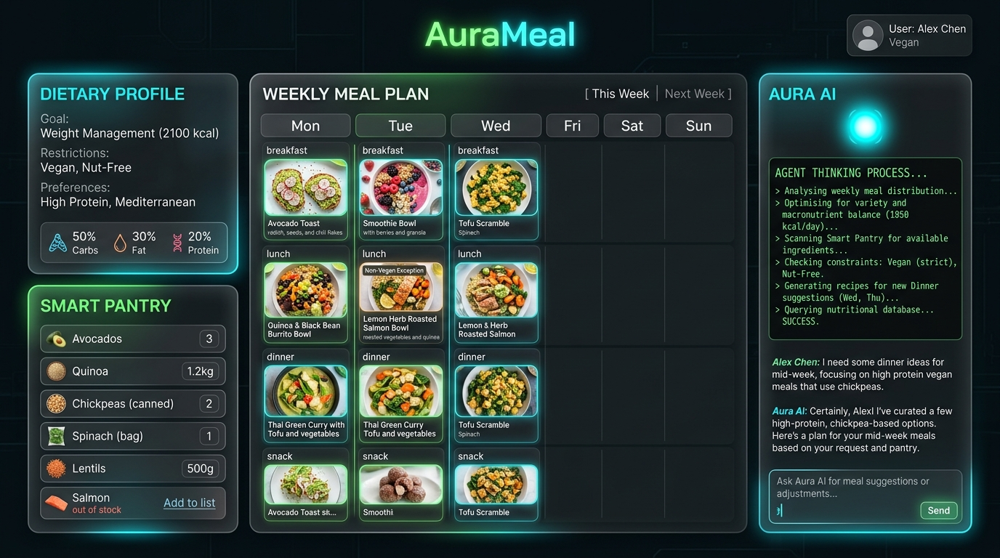

# ✦ AuraMeal // Production-Grade Meal Planning Agent

AuraMeal is a production-grade, full-stack AI meal planning application implementing the Google Agent rubrics. It features a glowing dark-mode glassmorphic frontend served by a FastAPI Python backend, utilizing a real LLM for reasoning, tool calling, memory management, and semantic search.



---

## 🚀 Key Features

### 1. 🤖 Aura AI Agent Interface
- **Real LLM Integration**: Uses the official `google-genai` SDK to connect to `gemini-2.5-flash`.
- **Descriptive Python Tool Specifications**: Defined python tools with type hints and explicit docstrings (e.g. `get_recipes_by_filters`, `get_recipes_by_pantry`, and `search_recipes_semantic`).
- **Guided Error Handling**: Tools wrapped in try-except clauses returning clean structured JSON error strings back to the LLM.

### 2. 🧠 Context & Memory
- **Persona System Instruction**: Detailed persona setup prescribing limits, diets, and formatting guidelines.
- **Context Bloat Prevention**: Chat history limited to the last 10 messages before LLM model dispatch.
- **Vector Database Integration**: Uses a custom, dependency-free `RecipeVectorStore` calculating cosine similarity over text embeddings (`text-embedding-004`) for high-fidelity semantic recipe search.
- **Persistent Conversation Memory**: Writes chat transcripts and metadata to an SQLite backend (`aurameal.db`).

### 3. ⚙️ Orchestration & Logic
- **Structured Function Calling**: Declares schemas and routes control flows dynamically using function declarations.
- **State Swapping Logic**: Automatically extracts target day/meal category details in Python (`targetSlot`) and updates the state.
- **Guardrails**: System guidelines enforce allergy rules and safety limits.

### 4. 🔍 Observability & Tracing
- **Structured JSON Logging**: Custom `JSONFormatter` formatting logs for aggregation pipelines.
- **Distributed Tracing**: Integrates OpenTelemetry tracers and exporter spans for model calls.
- **PII Redaction**: Regular expression checks (`redact_pii`) sanitize emails and phone numbers from chat databases.
- **Execution Log Dashboard**: Exposes `/api/logs` endpoint to view execution details.

### 5. 🛠️ Infrastructure & CI/CD
- **Automated Test Suite**: Pytest tests in `test_agent.py` validating PII filters, ingredient parsing, and recipe constraints.
- **Infrastructure as Code (IaC)**: Dockerfile containerization and multi-container Docker Compose.
- **Secure Secret management**: Dotenv validations prevent starting without key inputs.

---

## ⚡ Setup & Local Development

1. **Clone the repository**:
   ```bash
   git clone git@github.com:yrvij/aurameal-agent.git
   cd aurameal-agent
   ```

2. **Configure API Key**:
   Create a `.env` file from the template:
   ```bash
   cp .env.example .env
   # Edit .env and enter your GEMINI_API_KEY
   ```

3. **Install dependencies and run**:
   ```bash
   python3 -m venv venv
   source venv/bin/activate
   pip install -r requirements.txt  # Or install individual packages: fastapi uvicorn google-genai pytest python-dotenv
   python server.py
   ```

4. **Access the application**:
   Open [http://localhost:8080](http://localhost:8080) in your web browser.

5. **Run tests**:
   ```bash
   pytest test_agent.py
   ```
